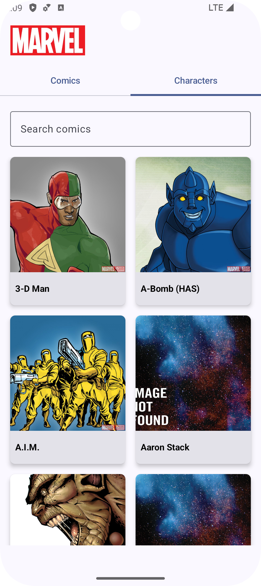
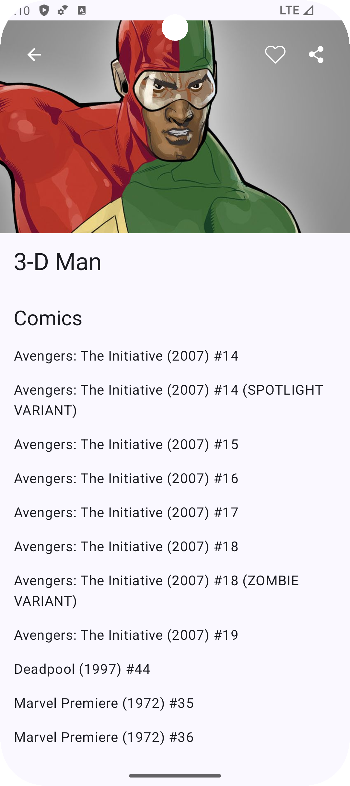
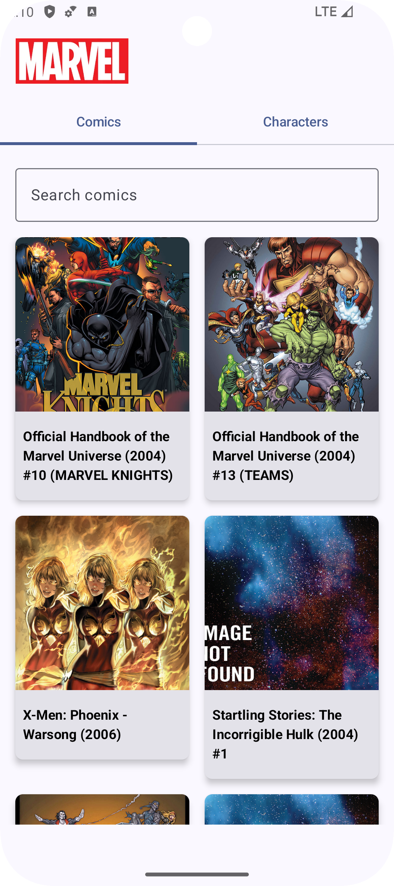
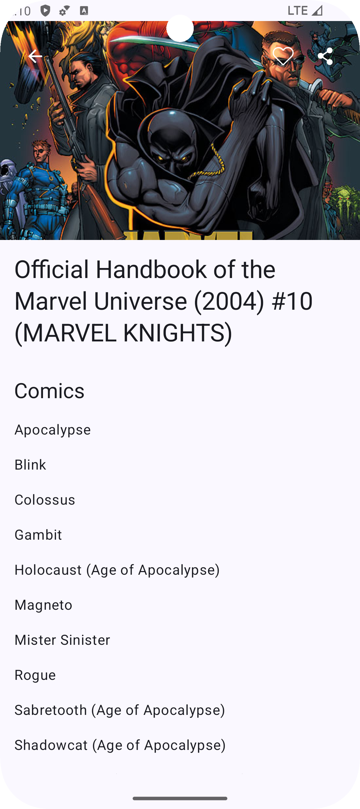

## Marvel App

The **Marvel App** allows users to browse through a collection of Marvel superheroes and comics, displaying essential information from the Marvel API. The app leverages a modern Android development stack including **Jetpack Compose**, **Ktor**, **Room**, and **Paging 3**, following **Clean Architecture** principles and **modularization** for scalability and maintainability.

## Screenshots

| Home Screen                                  | Character Details                                  |
|----------------------------------------------|----------------------------------------------------|
|  |  |
| Comic List                                   | Comic Details                                      |
|   |      |

## Features

- **Browse Superheroes & Comics**: Explore a list of superheroes and comics from the Marvel Universe.
- **Search Functionality**: Search for characters or comics by name.
- **Details Page**: View detailed information about each character or comic.
- **Paging**: Scroll through large lists of data with efficient pagination.
- **Offline Support**: Data is cached locally using Room for faster loading times and offline browsing.

## Architecture

This project follows **Clean Architecture** principles to separate concerns and maintain a modular and scalable codebase:

- **UI Layer**: Built with **Jetpack Compose** to create modern, declarative UIs.
- **Domain Layer**: Contains business logic, including use cases and models.
- **Data Layer**: Manages data fetching from the **Marvel API** and local caching using **Room**.

The app is divided into multiple modules to ensure a clear separation of concerns and to improve build times and testability.

## Tech Stack

### Android Framework

- **Jetpack Compose**: Used for the entire UI layer, including navigation between screens.
- **Navigation Component**: Manages navigation in a composable-first architecture.
- **Paging 3**: For efficient and dynamic data loading from the API and local database.

### Networking

- **Ktor**: A Kotlin-based HTTP client for network requests to the Marvel API.
- **Coil**: For efficient image loading and caching, including support for asynchronous loading and image transformations.

### Persistence

- **Room**: Database solution for local caching, allowing offline browsing and persistence across sessions.

### Dependency Injection

- **Koin**: A lightweight dependency injection framework used to manage dependencies across modules.

### Other

- **Custom Gradle Plugins**: Custom build logic and tasks to automate repetitive tasks, improve modularization, and enhance the build process.

## Modularization

The app is divided into several modules for better scalability and maintainability:

- **core**: The main application module containing the core logic for the app's flow.
- **feature-home**: Responsible for the home screen where users can browse characters and comics.
- **feature-details**: Manages the character and comic detail screens.
- **data**: Handles data fetching and caching using Ktor and Room.
- **domain**: Contains use cases and business logic.
- 
## Custom Gradle Plugins

The project uses **custom Gradle plugins** to manage common tasks and ensure modularization. You can find these plugins under the `gradle-plugins-tooling` module. These plugins handle tasks like managing dependencies, automating module setup, and ensuring consistency across different project modules.

## Future Enhancements

- **Save favorite comic & character**: Save favorite comic & character (show them in the list).
- **Dependabot**: Use dependabot to automatically receive pull requests to update dependencies.
- **Unit Testing & UI Testing**: Increase test coverage, especially for the ViewModel and UI layers.
- **Dark Mode Support**: Implement a theme switcher to support dark mode.
- **Internationalization (i18n)**: Add support for multiple languages.
